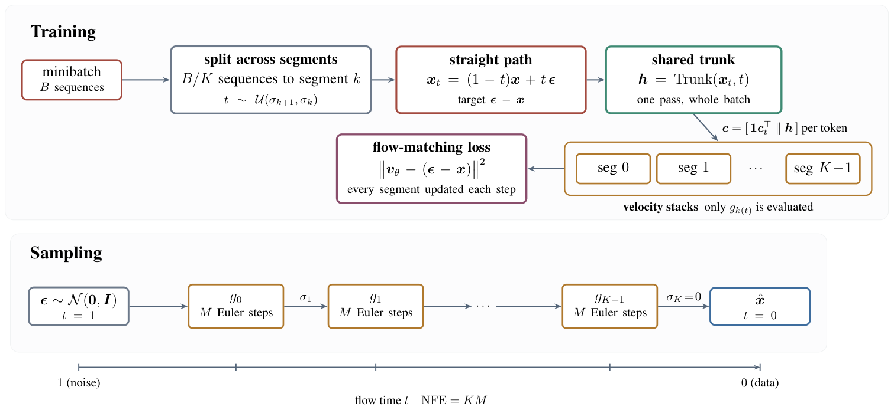
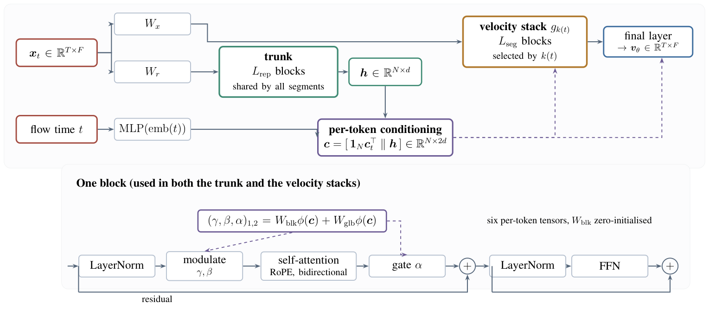

# SFM-Time

Reference implementation of **SFM-Time: Segmented Flow Matching for Time-Series
Generation**.

Flow matching generates by integrating a learned velocity field from noise to
data along the linear path. One network usually has to represent that field over
the whole path, though its task changes along it: near the noise end the target
is dominated by the unpredictable noise draw and only coarse structure is
recoverable, while near the data end the residual is small and local.

SFM-Time partitions flow time into *K* contiguous segments and gives each its
own small stack of velocity blocks, while a single shared representation trunk
conditions every stack per time step. Sampling walks the segments from noise to
data with *M* Euler steps inside each, so the cost is **NFE = KM = 80** in the
reported setting. Four pieces make this work on sequences:

- a **partition of flow time**, uniform in *t*, with one specialist velocity
  stack per interval, so the model holds `L_rep + K·L_seg` blocks but evaluates
  only `L_rep + L_seg` of them per step;
- a **shared representation trunk** that runs once per step and supplies
  per-token conditioning to whichever specialist owns the current *t*;
- **per-token adaptive layer norm**, with a global and a per-block term, so the
  conditioning varies along the sequence rather than once per sequence;
- a **bidirectional Transformer** over timesteps, one token per step, with
  **rotary position embeddings** so attention sees relative temporal offsets.

Training splits each minibatch evenly across the segments and draws the
interpolation time inside each segment's own interval — a stratified estimator
of the usual flow-matching objective, with the same optimum, that updates every
specialist at every step instead of whichever one a uniform draw happened to
land in.

Although it is trained unconditionally, the same model does imputation and
forecasting with no retraining and no extra function evaluations — see
[Conditional generation](#conditional-generation).

<p align="center">
  
</p>

<p align="center">
  
</p>

## Install

```bash
pip install -r requirements.txt
```

Runs on CPU, CUDA, or Apple Silicon (MPS); the device is selected
automatically.

## Quickstart

Three notebooks. The first writes what the other two read, so running them in
order needs no arguments.

| notebook | what it does |
|---|---|
| `01_train_and_sample.ipynb` | choose a dataset, train, sample, plot the samples and a PCA |
| `02_evaluate.ipynb` | score those samples with every metric in the paper, and compare them to real data by PCA, t-SNE, value density and power spectrum |
| `03_conditional.ipynb` | impute hidden entries and forecast a held-out horizon from the trained model, without retraining |

Defaults are the reported configuration, so `01` unchanged reproduces the
paper's model for the chosen dataset. Training takes roughly 20 minutes on
Sines on an M-series GPU, and about 42, 40 and 66 minutes on Stocks, Energy and
ECG; lower `STEPS` for a faster look.

From the command line instead:

```bash
python scripts/train_sfmtime.py --dataset sines --steps 6000 --dir results/run
```

```bash
python scripts/evaluate_saved.py --datasets sines --suffix sfmtime --dir results/run/sines_sfmtime
```

## Configuration

The reported setting, shared across all four benchmarks except for the width:

| | |
|---|---|
| segments *K* | 4 |
| velocity blocks per segment `L_seg` | 2 |
| trunk blocks `L_rep` | 4 |
| blocks evaluated per step | 6 of 12 |
| width *d* | 96 (128 on Energy) |
| attention heads | 4 |
| feed-forward expansion | 4 |
| patch size along time | 1 (one token per step) |
| position encoding | rotary, over timesteps |
| optimizer steps | 6,000 |
| batch size | 128 |
| learning rate | 1e-4, 200 warmup steps |
| EMA decay | 0.999 |
| Euler steps per segment *M* | 20 |
| **NFE** | **80** |

## Data

Four benchmarks: Sines and ECG (synthetic), Stocks and Energy (real CSVs under
`data/`). Windows are cut with stride 1, each feature is scaled to [-1, 1] over
all windows, and the result is split 80/10/10.

```bash
python scripts/export_splits.py
```

writes `data/splits/*.npz` plus a manifest. Every reported number is computed
from those arrays, so a competing method can be trained and scored on exactly
the same sequences. Write its samples as `<dataset>_<method>_data.npz` with the
keys `real_train`, `real_val`, `real_test`, `generated`, then

```bash
python scripts/evaluate_saved.py --suffix <method> --dir <folder>
```

scores it with identical code.

| dataset | *T* | features | train / val / test |
|---|---|---|---|
| Sines | 64 | 4 | 8,000 / 1,000 / 1,000 |
| Stocks | 128 | 6 | 3,443 / 430 / 431 |
| Energy | 96 | 5 | 15,712 / 1,964 / 1,964 |
| ECG | 192 | 2 | 6,400 / 800 / 800 |

## Metrics

Seven, all lower-is-better, in `sfmtime/metrics.py`:

- **discriminative** — `|0.5 − accuracy|` of a GRU trained to separate real from
  generated, so 0 means it cannot;
- **predictive** — error of a GRU trained on generated and tested on real;
- **Context-FID** — Fréchet distance in the representation space of a TS2Vec
  encoder fitted on the real sequences;
- **correlational** — difference in cross-channel correlation structure;
- **increment**, **autocorrelation**, **spectral** — distances between the two
  distributions of step-to-step differences, of autocorrelation by lag, and of
  mean log power spectra.

The first three train a network and therefore carry estimator variance. On
*fixed* data the discriminative score moves enough across evaluator seeds that a
single-seed number can be read as a large difference when nothing has changed,
so `evaluate_saved.py` reports mean ± standard deviation over `--repeat` seeds
and any table should carry that.

## Conditional generation

The model is trained unconditionally, but the linear interpolation it is trained
on gives a direct way to enforce observations during sampling. Let **y** be a
target sequence and *m* mark its observed entries. Given the velocity **v** at
(**x**_t, *t*), the division-free clean estimate and the noise it implies are

```
x̂₀ = x_t − t·v,        ε̂ = x̂₀ + v
```

which reproduce the state exactly, since (1−t)·x̂₀ + t·ε̂ = x_t. Writing the
observation into x̂₀ and re-forming the state at the next time *t′* gives the
update used here:

```
x_obs ← (1−t′)·y + t′·ε̂
x_hid ← x_t + (t′−t)·v
```

Wherever *m* = 0 this is the plain Euler step, so conditioning changes the
update rule only at the observed entries. At *t* = 0 the carried target is **y**
itself, so every observation is reproduced exactly — the maximum absolute error
at observed entries is 0 in every configuration evaluated. The update is
elementwise arithmetic, so it adds **no network evaluations**: conditional
samples cost the same 80 evaluations as unconditional ones.

The textbook form instead overwrites the state with the observation re-noised by
an independently drawn ε. That splices a model-independent trajectory into the
state the next evaluation reads, and the hidden region has no way to reconcile
with a trajectory it did not produce; imposing the constraint on the clean
estimate removes the splice at no cost.

```bash
python scripts/conditional.py --datasets sines --ratios 0.1,0.3,0.5,0.7,0.9 \
    --styles separate,concurrent --horizons 0.125,0.25,0.5 --n 250 --k 10
```

Imputation hides contiguous streaks of geometric length (mean 3) — isolated
missing values are often recoverable by interpolation alone and make a much
weaker test. Forecasting hides the final *h* ∈ {T/8, T/4, T/2} steps. Scores are
the squared error of the K-sample mean (squared error is minimised by the
conditional mean, so scoring one random draw would penalise exactly the
predictive variation a calibrated model should have) and CRPS. The references
are linear interpolation and last-value repetition: scales rather than
competitors, since under a random walk they are the posterior mean.

Conditioning this way enforces the observations exactly, but it is an
approximate conditioning method, not an exact sampler from the conditional
distribution.

## Layout

```
sfmtime/
  config.py        configuration and presets; what is kept and what changed
  model.py         the segmented velocity field and the shared trunk
  modules.py       attention, rotary embeddings, the adaptive-layer-norm block
  flow.py          segment schedule, stratified loss, sampler, conditioning
  diffusion.py     the diffusion core used by one ablation arm
  train.py         training loop, EMA, health checks
  data.py          the four benchmarks, windowing, scaling, splits
  metrics.py       the seven evaluation metrics
  benchmark_metrics.py, ts2vec.py   the published benchmark protocol
scripts/
  export_splits.py     write the canonical splits
  train_sfmtime.py     train one model and save samples
  evaluate_saved.py    score any saved samples, multi-seed
  conditional.py       the full imputation and forecasting protocol
data/                  CSVs and exported splits
docs/                  figures used by this README
```

## Health checks

Three failure modes are specific to this design and silent if unchecked: a
segment that never receives gradient (so one stack stays at initialization), a
wildly imbalanced per-segment residual, and a sampler that returns constant or
non-finite sequences. `SFMTimeTrainer.health_check()` tests all three and both
notebook 1 and `train_sfmtime.py` run it after training.

## Acknowledgement

The segmentation of flow time and the shared-trunk conditioning follow Blockwise
Flow Matching (Park et al., NeurIPS 2025, arXiv:2510.21167), which was developed
for image latents. What is adapted here is the backbone, the token layout, the
training stratification and the sampler, so that the field operates on
`(B, T, F)` sequences.
